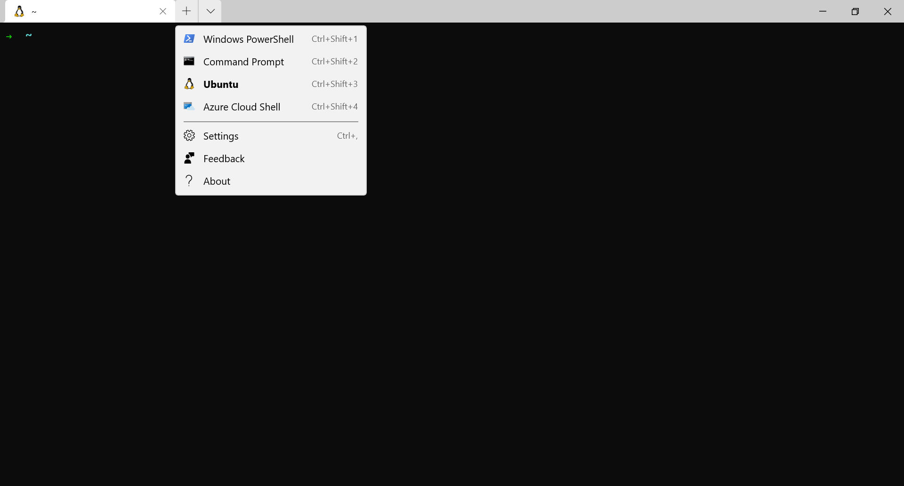
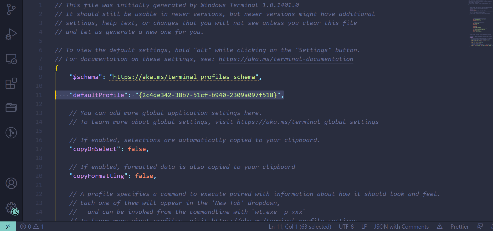
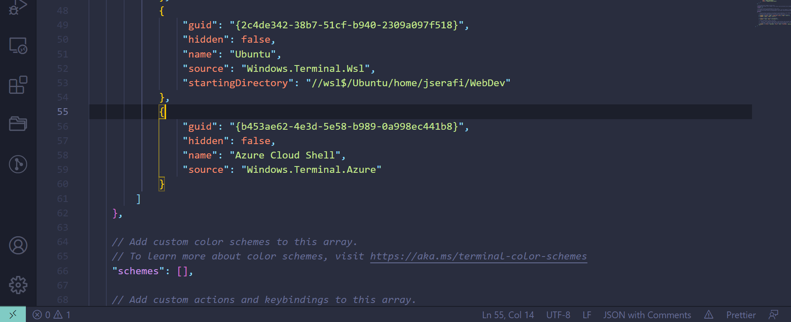

# Installfest for Windows, Step 1: Unix Terminal on Windows

1. Follow [Microsoft's instructions](https://msdn.microsoft.com/en-us/commandline/wsl/install_guide) to get Windows Subsystem Linux 2 installed on your system.

2. Download [Ubuntu](https://www.microsoft.com/en-us/p/ubuntu/9nblggh4msv6#activetab=pivot:overviewtab) (no version after it) from the Microsoft Store desktop app to install an Ubuntu environment. This linux distribution will have some features and software (like Python3) pre-installed.

4. Install [Windows Terminal](https://www.microsoft.com/en-us/p/windows-terminal/9n0dx20hk701?activetab=pivot:overviewtab) from the Microsoft App Store.

5. Install [VSCode](https://code.visualstudio.com/). This will be your main text editor.

## Setting Windows Terminal to Use Ubuntu by default

While you downloaded an Ubuntu command line from the Microsoft Store, we recommend using Windows Terminal as your main command line, as it is easier to adjust some settings.

Open up Windows Terminal and click on the the downward facing arrow next to the new tab (+) button. Click on the settings button.




look for a field called `defaultProfile: ...` in the settings.json file.



scroll down until you find a field called `"profiles": ...` and look for `"list":...` nested inside

copy the `guid: "{...}"` of `name: ubuntu` and paste it into `defaultProfile:...`. It will look similar to the screenshot below. Notice the startingDirectory field. If you have a fresh install, that will not be there. 



Inside the `guid: {UBUNTU GUID}`, add a new property beneath `name: ubuntu`. This will be the default folder that opens when you launch your terminal.

`"startingDirectory": "//wsl$/Ubuntu/home/ YOUR USERNAME HERE `

Save the settings.json file and return to Windows terminal.

4. Type `pwd` at the command line. If it gives a path similar to `/home/yourname`, then you're in great shape! If it says that is not a recognized command, try running `bash` or `zsh` first and then `pwd`. 

If you do not have Zsh installed, I recommend installing Zsh with the following command:

`sudo apt-get update && sudo apt-get -y install zsh`

Make Zsh your default terminal by running:

`chsh -s /bin/zsh`

Install a Zsh theme like [oh-my-zsh](https://ohmyz.sh/) to have a beautiful, easy to use Zsh terminal!

5. Run `apt-get update` to ensure your Linux installation is up to date.

6. Run
```
sudo apt-get -f install
```
to ensure all default packages are installed.

Excellent-you now have Linux installed on your computer, which will let you use the nearly same commands as everyone else for the remainder of the course.

For example, when someone with a Mac says "command" or "apple" key, press control instead. Other keyboard commands may be different, and we've highlighted a few for you to memorize.

7. Git

[Your next step will be installing git!](git-installation.md)

* [x] Command Line
* [ ] [Installing Git](git-installation.md)
* [ ] [Databases and Frameworks](db-frameworks.md)
* [ ] [Desktop Applications](desktop-applications.md)
